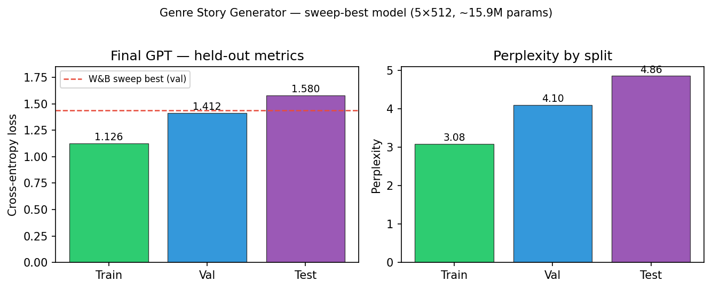

# Genre Story Generator

MLOps-driven **decoder-only GPT** (PyTorch, from scratch) trained on [TinyShakespeare](https://huggingface.co/datasets/karpathy/tiny_shakespeare) (~1M characters). The pipeline covers exploration → preprocessing → baseline → W&B hyperparameter sweeps → final training → evaluation → interactive inference → deployment prototypes. All work lives in eight Jupyter notebooks under `notebooks/`, tracked on [Weights & Biases](https://wandb.ai) project `genre-story-generator`.

## Installation & run

```bash
python -m venv .venv && source .venv/bin/activate
pip install -r requirements.txt
wandb login   # optional but needed for sweeps/artifacts
```

**Data** — from repo root:

```bash
python src/ingest-data.py
```

**Notebooks** (run in order; launch Jupyter from repo root or `notebooks/`):

| # | Notebook |
|---|----------|
| 1 | Data Exploration |
| 2 | Preprocessing |
| 3 | Baseline Model Architecture |
| 4 | Hyperparameter Tuning |
| 5 | Model Training |
| 6 | Evaluation & Model Comparison |
| 7 | Inference & Interactive Generation |
| 8 | Deployment & Model Export |

Artifacts land in `data/artifacts/` (vocab, token tensors, `gpt_best.pt`, W&B exports). Checkpoints are gitignored; re-run notebooks 2 → 5 to reproduce locally.

## Model results

Best config from Bayesian sweep `kbmij8of` (run `earthy-sweep-6`): **5 layers, d_model 512, 8 heads**, ~15.9M parameters, character vocab ~65, `block_size` 128. Final cosine-decay training matched or beat the sweep-best validation loss.

| Split | Loss | Perplexity |
|-------|------|------------|
| Train | 1.126 | 3.08 |
| Val | 1.412 | 4.10 |
| Test | 1.580 | 4.86 |

Qualitatively, generations follow Shakespearean script structure (`CHARACTER:` headers, dialogue blocks). See notebook 6–7 for prompt suites and sampling demos.



## Extra criteria pursued

| Criterion | What we did |
|-----------|-------------|
| **MLOps (W&B)** | Experiment tracking, Bayesian sweeps, checkpoint/vocab **artifacts**, sweep leaderboard and cached `sweep_best_config.json` |
| **Hyperparameter optimization** | Automated search over LR, depth, width, heads, dropout, weight decay, warmup (notebook 4) |
| **Deployment / serving** | Export bundle + character-level **streaming** inference; FastAPI `/stream` prototype (notebook 8) |
| **Rigorous evaluation** | Train/val/**test** metrics, generalization gap, baseline vs sweep-best comparison (notebook 6) |
| **Interactive inference** | Temperature / top-k / top-p controls with `ipywidgets` side-by-side comparison (notebook 7) |

*Not claimed:* full Streamlit/Gradio app (noted as future work in notebook 8), BPE tokenizer, multi-genre corpora.

## Difficulties & fixes

- **Small-corpus overfitting** — Large models memorized quickly; sweep + val/test monitoring and early stopping kept the chosen 5×512 config with a modest val–train gap (~0.29 loss).
- **Notebook path resolution** — Running from `notebooks/` vs repo root broke `data/` lookups; added `PROJECT_ROOT` detection in every notebook.
- **Baseline checkpoint overwrite** — Notebook 5 replaced the baseline weights; evaluation documents saving `gpt_baseline.pt` / `baseline_experiment.json` before the final run.
- **W&B config offline** — Final training uses `CONFIG_SOURCE=auto` with local JSON fallback when the API is unavailable.
- **128-token context in deployment** — Multi-character “stage improv” loses coherence over long transcripts; mitigated with `stop_on_double_newline` and shorter turns.

## Repository layout

```
notebooks/     # 1–8 pipeline
src/           # dataset ingest script
data/          # CSVs + artifacts (gitignored)
proposal.md    # project spec
docs/          # README figures
```
