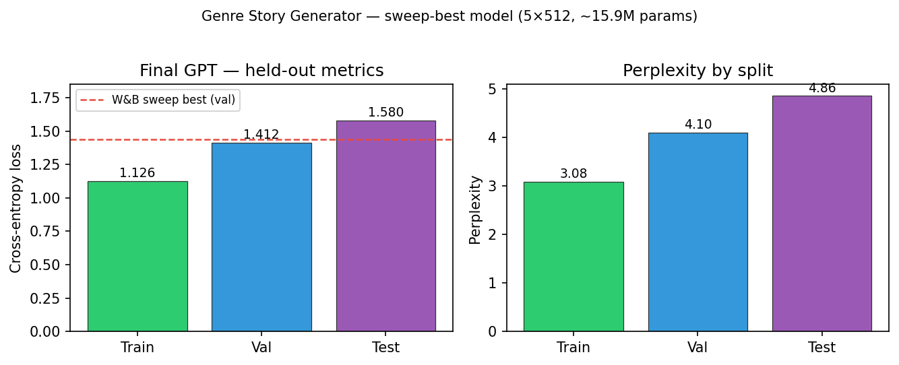
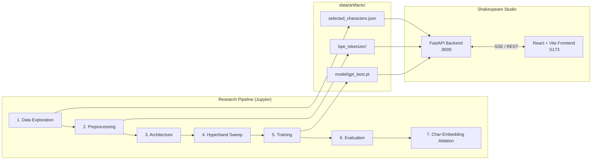
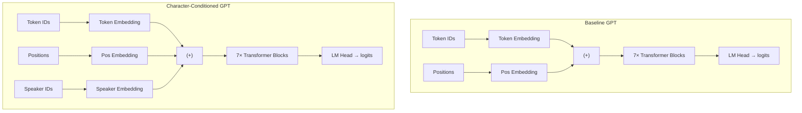
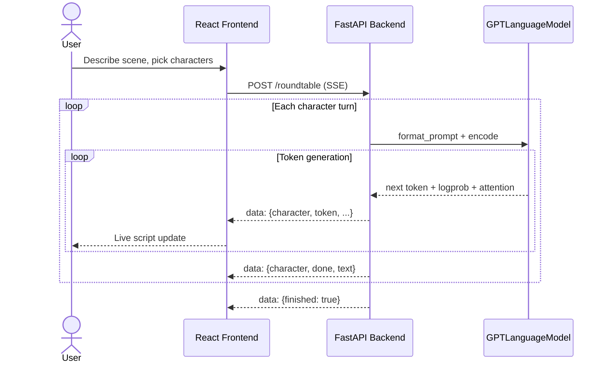
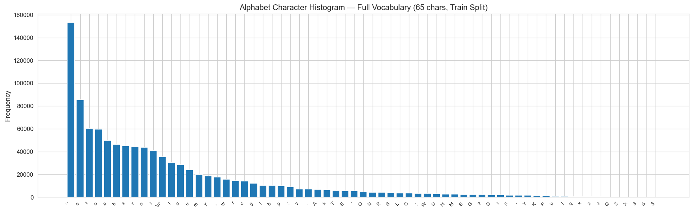
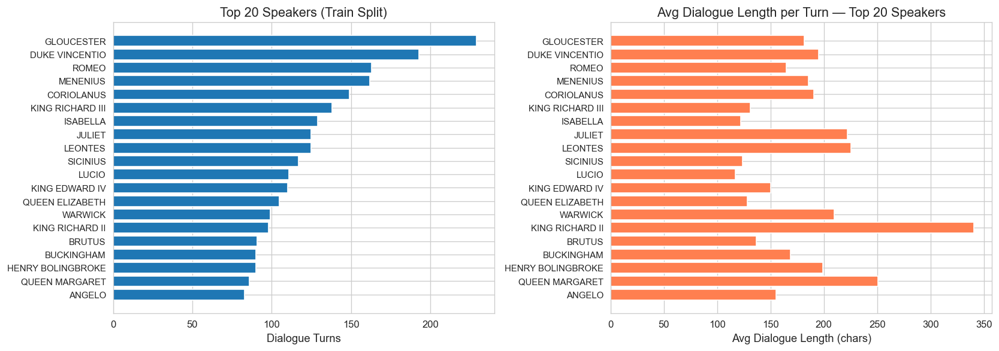
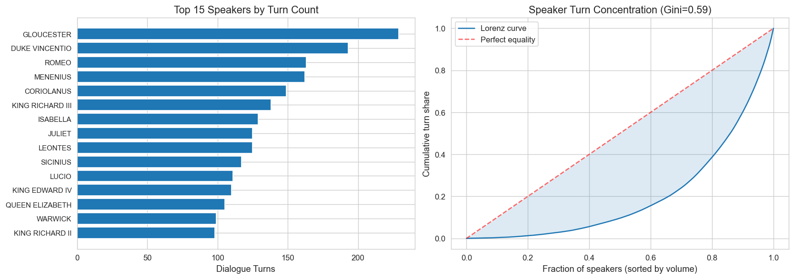
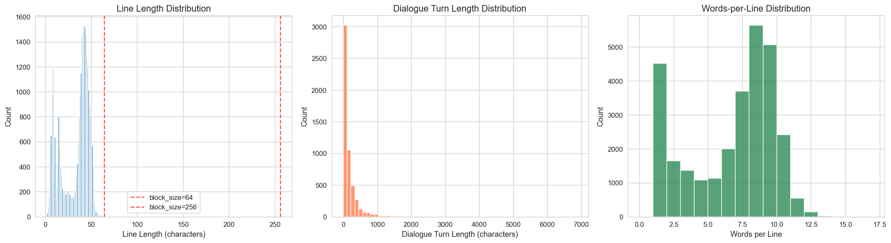

# Character-Conditioned GPT for Shakespearean Dialogue Generation

**Repository:** [github.com/utki007/genre-story-generator](https://github.com/utki007/genre-story-generator)

A university AI/ML research project that trains a decoder-only GPT from scratch on speaker-attributed Shakespearean dialogue, compares baseline vs. character-conditioned architectures, and deploys the trained model through **Shakespeare Studio** — a React + FastAPI application for multi-character scene generation.

---

## Table of Contents

1. [What Is Implemented](#what-is-implemented)
2. [Methods & Approach](#methods--approach)
3. [System Architecture](#system-architecture)
4. [Getting Started](#getting-started)
5. [Key Results](#key-results)
6. [Extra Criteria](#extra-criteria)
7. [Challenges & Solutions](#challenges--solutions)
8. [Repository Layout](#repository-layout)

---

## What Is Implemented

This project delivers a full **research → train → evaluate → deploy** pipeline for controlled dialogue generation.

| Component | Status | Description |
| :--- | :---: | :--- |
| Data exploration & parsing | ✓ | Regex-based speaker turn extraction from Tiny Shakespeare; frequency and length analysis |
| BPE tokenization | ✓ | GPT-2 byte-pair encoding (50,257 vocab) with speaker-attributed chunks |
| Baseline GPT | ✓ | 7-layer decoder-only Transformer (~31M params), trained from scratch |
| Character-conditioned GPT | ✓ | Additive speaker embeddings ablation (+0.13% parameters) |
| Hyperparameter tuning | ✓ | Hyperband sweep (30 trials) over depth, width, LR, dropout |
| Evaluation suite | ✓ | Global perplexity, per-speaker breakdowns, qualitative prompt batteries |
| FastAPI inference server | ✓ | SSE streaming, roundtable generation, arena comparison, XAI hooks |
| Shakespeare Studio UI | ✓ | Scene Generator (fully wired); Chat, Arena, Model Explorer (stubs) |

**Core research question:** Can lightweight speaker conditioning improve character voice consistency without per-character fine-tuning?

**Answer (empirical):** Yes for well-represented speakers; conditioning can *hurt* sparse speakers. Aggregate perplexity alone is insufficient — evaluation must be stratified by speaker frequency.



---

## Methods & Approach

### Problem formulation

Dialogue generation is framed as **causal language modeling** with optional speaker control:

\[
P(x_t \mid x_{<t},\, c) \quad \text{where } c \in \{\text{ROMEO, JULIET, MERCUTIO, \ldots}\}
\]

Two conditioning strategies are compared:

1. **Prefix conditioning (baseline):** Speaker identity is encoded only as a text prefix (`ROMEO:\n…`) in the training data.
2. **Embedding conditioning (ablation):** An additive speaker embedding is injected at the input layer:
   \[
   x = \text{Emb}_{\text{token}} + \text{Emb}_{\text{pos}} + \text{Emb}_{\text{speaker}}
   \]

### Dataset & preprocessing

| Step | Method |
| :--- | :--- |
| Source corpus | [karpathy/tiny_shakespeare](https://huggingface.co/datasets/karpathy/tiny_shakespeare) (~1M characters, 154 speakers) |
| Turn parsing | Regex: `^[A-Z][A-Z ]+:\n…` to split `SPEAKER:\n{dialogue}` blocks |
| Tokenization | GPT-2 BPE via `transformers` (migrated from initial character-level tokenizer) |
| Chunking | 256-token sliding windows; each token tagged with a speaker ID |
| Splits | Train / validation / test with reproducible seeded `DataLoader`s |

### Model architecture

Custom PyTorch implementation (no `nn.Transformer` wrapper):

- **7 transformer blocks**, 256-dim hidden size, 8 attention heads
- Pre-norm LayerNorm + residual connections
- Causal (masked) multi-head self-attention → GELU feed-forward (4× expansion)
- Weight-tied token embedding and LM head
- Optional `capture_attn` hook on the final attention head for explainability

### Training

| Hyperparameter | Value (sweep-selected) |
| :--- | :--- |
| Optimizer | AdamW |
| Learning rate | 1.37 × 10⁻⁴ with cosine decay |
| Dropout | 0.1648 |
| Mixed precision | AMP on CUDA |
| Early stopping | Patience 3; both models stopped at step 1500 |
| Reproducibility | Fixed seeds; identical batch order for baseline vs. conditioned ablation |

### Evaluation

- **Global validation perplexity** — primary quantitative metric
- **Per-character perplexity** — `eval_battery` over speaker-conditioned segments
- **Qualitative prompt batteries** — fixed prefixes (`ROMEO:`, `JULIET:`) to detect speaker-cue confusion and repetition collapse
- **Arena mode** — same prompt, multiple characters, side-by-side perplexity comparison

### Inference & decoding

Deployed generation uses **nucleus-style sampling** with guardrails:

- Temperature = 0.8, top-k = 40 (top-p available in model `generate()`)
- `format_prompt()` prepends `CHARACTER:` cues
- `trim_at_speaker_boundary()` stops when a new speaker cue appears
- `strip_leading_speaker_cue()` removes leaked prefix artifacts
- SSE events stream per-token text, log-probabilities, running perplexity, and downsampled attention matrices

---

## System Architecture

### End-to-end pipeline


```mermaid
flowchart LR
    subgraph Research["Research Pipeline (Jupyter)"]
        N1["1. Data Exploration"]
        N2["2. Preprocessing"]
        N3["3. Architecture"]
        N4["4. Hyperband Sweep"]
        N5["5. Training"]
        N6["6. Evaluation"]
        N7["7. Char-Embedding Ablation"]
        N1 --> N2 --> N3 --> N4 --> N5 --> N6 --> N7
    end

    subgraph Artifacts["data/artifacts/"]
        TOK["bpe_tokenizer/"]
        CKPT["model/gpt_best.pt"]
        CHARS["selected_characters.json"]
    end

    subgraph Deploy["Shakespeare Studio"]
        BE["FastAPI Backend\n:8000"]
        FE["React + Vite Frontend\n:5173"]
    end

    N2 --> TOK
    N5 --> CKPT
    N1 --> CHARS
    TOK --> BE
    CKPT --> BE
    CHARS --> BE
    BE <-->|"SSE / REST"| FE
```

### Model input representation


```mermaid
flowchart TB
    subgraph Baseline["Baseline GPT"]
        T1["Token IDs"] --> TE1["Token Embedding"]
        P1["Positions"] --> PE1["Pos Embedding"]
        TE1 --> ADD1["(+)"]
        PE1 --> ADD1
        ADD1 --> TB1["7× Transformer Blocks"]
        TB1 --> LH1["LM Head → logits"]
    end

    subgraph Conditioned["Character-Conditioned GPT"]
        T2["Token IDs"] --> TE2["Token Embedding"]
        P2["Positions"] --> PE2["Pos Embedding"]
        S2["Speaker IDs"] --> SE2["Speaker Embedding"]
        TE2 --> ADD2["(+)"]
        PE2 --> ADD2
        SE2 --> ADD2
        ADD2 --> TB2["7× Transformer Blocks"]
        TB2 --> LH2["LM Head → logits"]
    end
```

### Shakespeare Studio request flow


```mermaid
sequenceDiagram
    actor User
    participant UI as React Frontend
    participant API as FastAPI Backend
    participant GPT as GPTLanguageModel

    User->>UI: Describe scene, pick characters
    UI->>API: POST /roundtable (SSE)
    loop Each character turn
        API->>GPT: format_prompt + encode
        loop Token generation
            GPT-->>API: next token + logprob + attention
            API-->>UI: data: {character, token, ...}
            UI-->>User: Live script update
        end
        API-->>UI: data: {character, done, text}
    end
    API-->>UI: data: {finished: true}
```

### API surface

| Endpoint | Method | Purpose |
| :--- | :--- | :--- |
| `/health` | GET | Model load status, device, vocab info |
| `/characters` | GET | Available speaker list from artifacts |
| `/generate` | POST (SSE) | Single-character streaming generation |
| `/roundtable` | POST (SSE) | Multi-turn, multi-character scene |
| `/arena` | POST | Same prompt across characters + perplexity |
| `/top_tokens` | POST | Next-token probability distribution |

---

## Getting Started

### Prerequisites

| Requirement | Version / notes |
| :--- | :--- |
| Python | 3.10+ recommended |
| Node.js & npm | Required for the React frontend |
| GPU (optional) | CUDA accelerates training; CPU works for inference |
| Disk space | ~500 MB for artifacts after training |

### 1. Clone and install dependencies

```bash
git clone https://github.com/utki007/genre-story-generator.git
cd genre-story-generator

# Python environment (recommended)
python3 -m venv .venv
source .venv/bin/activate        # Windows: .venv\Scripts\activate

# Research + backend dependencies
pip install -r requirements.txt
```

> **Note:** Model weights (`*.pt`) and `data/` artifacts are gitignored. You must run the training notebooks locally (or place pre-trained artifacts under `data/artifacts/`).

### 2. Run the experimental pipeline

Open and execute notebooks **in order** (each writes outputs consumed by the next):

| Notebook | Produces |
| :--- | :--- |
| `notebooks/1. Data Exploration.ipynb` | Speaker statistics, `selected_characters.json` |
| `notebooks/2. Preprocessing.ipynb` | BPE tokenizer, train/val/test splits |
| `notebooks/3. Baseline Model Architecture.ipynb` | GPT module definition, config |
| `notebooks/4. Hyperparameter Tuning.ipynb` | Hyperband sweep results (~38 min) |
| `notebooks/5. Model Training.ipynb` | `data/artifacts/model/gpt_best.pt` |
| `notebooks/6. Evaluation & Model Comparison.ipynb` | Perplexity tables, qualitative plots |
| `notebooks/7. Experiment - Character Embeddings.ipynb` | Baseline vs. conditioned ablation report |

After notebook 5 completes, verify artifacts exist:

```bash
ls data/artifacts/bpe_tokenizer/
ls data/artifacts/model/gpt_best.pt
ls data/artifacts/selected_characters.json
```

### 3. Launch Shakespeare Studio

The launcher starts both servers and handles frontend setup automatically:

```bash
python3 run_studio.py
```

| Service | URL |
| :--- | :--- |
| Backend (FastAPI) | http://127.0.0.1:8000 |
| Frontend (Vite) | http://127.0.0.1:5173 |
| Health check | http://127.0.0.1:8000/health |

**Launcher options:**

```bash
python3 run_studio.py --backend-port 8000 --frontend-port 5173
python3 run_studio.py --no-install    # skip npm install if node_modules exists
python3 run_studio.py --no-reload     # disable uvicorn auto-reload
```

Press `Ctrl+C` to stop both servers.

### 4. Run services separately (optional)

**Backend only:**

```bash
cd backend
python3 -m uvicorn main:app --host 127.0.0.1 --port 8000 --reload
```

**Frontend only:**

```bash
cd frontend
cp .env.example .env    # sets VITE_API_BASE_URL=http://localhost:8000
npm install
npm run dev
```

### 5. Using the Scene Generator

1. Open http://127.0.0.1:5173
2. Confirm the health banner shows the model is loaded (if degraded, re-run notebooks 2–5)
3. Enter a scene description (e.g., *"A moonlit balcony confession"*)
4. Select 2–6 characters and adjust temperature
5. Click **Generate** — dialogue streams turn-by-turn into a color-coded script panel

### Troubleshooting

| Symptom | Fix |
| :--- | :--- |
| `503 Model not loaded` | Run notebooks 2–5; confirm `data/artifacts/model/gpt_best.pt` exists |
| `npm not found` | Install Node.js from [nodejs.org](https://nodejs.org/) |
| `uvicorn not installed` | `pip install -r requirements.txt` |
| CORS / connection errors | Ensure backend is running; check `frontend/.env` matches backend port |
| Frontend shows "degraded" | Visit `/health` — the `error` field describes the missing artifact |

---

## Key Results

| Metric | Baseline | Char-Conditioned | Δ |
| :--- | ---: | ---: | ---: |
| Parameters | 31.3M | 31.4M | +0.13% |
| Val perplexity | 96.46 | **93.84** | −2.71% |
| Best step | 1500 | 1500 | — |

**Qualitative findings:**

- Baseline confuses speakers (e.g., `ROMEO:` prompts elicit `MERCUTIO:` cues)
- Conditioned model maintains thematic vocabulary and reduces cue-repetition for major characters (Juliet)
- Sparse speakers (e.g., GREMIO) show perplexity *regression* under embedding conditioning

**Takeaway:** Parameter-efficient conditioning is viable for stylized dialogue, but evaluation must be stratified by speaker frequency — not just aggregate perplexity.

### Data exploration









---

## Extra Criteria

### Chatbot GUI ✓

**Shakespeare Studio** pairs a Vite/React frontend (Tailwind CSS, Zustand state) with a FastAPI backend. The **Scene Generator** tab supports character selection, temperature control, and turn-based roundtable generation (`POST /roundtable`). Script output renders as a color-coded play transcript with live typing indicators. Additional tabs (Chat, Arena, Model Explorer) expose backend endpoints but remain UI stubs.

### Explainable AI (XAI) ✓ (partial)

The GPT implementation captures the final attention head during inference (`capture_attn` in `backend/model/gpt.py`). The streaming API returns per-token log-probabilities, running perplexity, and downsampled attention matrices (`backend/inference.py`). A `TokenSpan` component maps log-prob to color for surprise visualization; full attention UI is not yet wired into the frontend.

### MLOps ✓ (partial)

Notebook 4 runs a **Hyperband sweep** (30 trials, ~38 min) over learning rate, depth, width, dropout, and LR schedules, logging results locally with Spearman importance and Pareto analysis. Notebook 7 conducts a **reproducible ablation**: identical seeded batch sequences for baseline vs. conditioned models, JSON experiment reports, and versioned checkpoints. Weights & Biases was planned but replaced with local JSON/matplotlib logging for reproducibility without external dependencies.

### Multimodal ✗

Text-only; no image or audio modalities.

---

## Challenges & Solutions

| Challenge | Solution |
| :--- | :--- |
| Regex turn extraction missed edge-case stage directions | Documented sparsity limits; unknown-speaker bucket (ID 0) |
| Character-level tokenizer had poor subword coverage | Migrated to GPT-2 BPE; ~3% val tokens mapped to unknown speakers |
| Training instability at high LR | Hyperband sweep identified stable hyperparameters; cosine LR decay |
| Greedy decoding caused repetition loops | Nucleus sampling (T=0.8, top-k=40) + `trim_at_speaker_boundary` |
| Sparse speaker overfitting under embeddings | Per-character eval revealed signal washout; motivates contrastive regularization |
| Frontend/backend integration | Lifespan-managed model state, `/health` endpoint, SSE roundtable streaming |

---

## Repository Layout

```
genre-story-generator/
├── notebooks/          # 7-notebook experimental pipeline (1 → 7)
├── backend/
│   ├── main.py         # FastAPI app + SSE endpoints
│   ├── inference.py    # Streaming, roundtable, arena, XAI helpers
│   ├── schemas.py      # Pydantic request/response models
│   └── model/
│       ├── gpt.py      # Decoder-only GPT (attention capture)
│       ├── tokenizer.py
│       └── loader.py   # Checkpoint + artifact loading
├── frontend/           # Shakespeare Studio (React + Vite + Tailwind)
├── data/artifacts/     # Generated by notebooks (gitignored)
├── docs/               # Result plots and exploration figures
├── run_studio.py       # One-command launcher (backend + frontend)
└── requirements.txt    # Python dependencies
```

---

## Citation & License

Course project — Northwestern University, Generative AI (Quarter 3).

For programmatic generation without the UI, see `backend/inference.py` (`stream_generate`, `format_prompt`, `roundtable_generate`).
