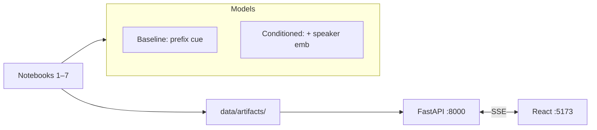

# Character-Conditioned GPT for Shakespearean Dialogue

**Repo:** [github.com/utki007/genre-story-generator](https://github.com/utki007/genre-story-generator)

Decoder-only GPT trained on Tiny Shakespeare (~1M chars, 154 speakers). Compares **prefix conditioning** (baseline) vs. **additive speaker embeddings** (+0.13% params), then deploys via **Shakespeare Studio** (React + FastAPI).

**Finding:** Conditioning improves well-represented speakers (val ppl 96.46 → 93.84) but hurts sparse ones — evaluate per speaker, not just aggregate perplexity.


---

## Quick Start

**Requires:** Python 3.10+, Node.js/npm. GPU optional for training.

```bash
git clone https://github.com/utki007/genre-story-generator.git
cd genre-story-generator
python3 -m venv .venv && source .venv/bin/activate
pip install -r requirements.txt
```

Artifacts (`data/artifacts/`) are gitignored — run notebooks **1→7** first (notebook 5 produces `gpt_best.pt`), then:

```bash
python3 run_studio.py
```

| Service | URL |
| :--- | :--- |
| Backend | http://127.0.0.1:8000 |
| Frontend | http://127.0.0.1:5173 |

`Ctrl+C` stops both. If the UI shows "degraded", re-run notebooks 2–5 or check `/health`.

---

## What's Implemented

| Layer | Details |
| :--- | :--- |
| **Data** | Regex speaker parsing → GPT-2 BPE → 256-token chunks with speaker IDs |
| **Model** | 7-layer GPT from scratch (~31M params): causal attention, pre-norm, GELU FFN |
| **Training** | AdamW, cosine LR, AMP, Hyperband sweep (nb 4), early stop @ step 1500 |
| **Eval** | Val perplexity, per-speaker `eval_battery`, prompt batteries (`ROMEO:`, `JULIET:`) |
| **Deploy** | FastAPI SSE streaming; Scene Generator UI wired; Chat/Arena/Explorer are stubs |
| **XAI** | Per-token logprobs + attention capture in API; partial frontend viz |

---

## Methods

**Baseline:** speaker as text prefix only — `ROMEO:\n{dialogue}`

**Ablation:** \(x = \text{Emb}_{token} + \text{Emb}_{pos} + \text{Emb}_{speaker}\)

**Decoding:** top-k sampling (T=0.8, k=40) with `trim_at_speaker_boundary` to stop cue leakage.

---

## Architecture


```mermaid
flowchart LR
    NB["Notebooks 1–7"] --> ART["data/artifacts/"]
    ART --> API["FastAPI :8000"]
    API <-->|SSE| UI["React :5173"]

    subgraph Models
        B["Baseline: prefix cue"]
        C["Conditioned: + speaker emb"]
    end
    NB --> Models
```

---

## Results

| Metric | Baseline | Conditioned | Δ |
| :--- | ---: | ---: | ---: |
| Params | 31.3M | 31.4M | +0.13% |
| Val ppl | 96.46 | **93.84** | −2.7% |


---

## Layout

`notebooks/` (pipeline) · `backend/` (FastAPI + GPT) · `frontend/` (Studio UI) · `docs/` (plots) · `run_studio.py` (launcher)