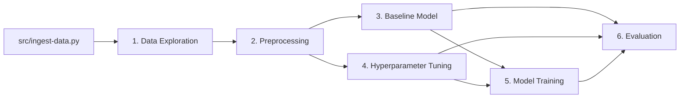

# Notebooks — High-Level Overview

This folder contains the end-to-end ML pipeline for a **character-conditioned Shakespeare dialogue generator**: a decoder-only GPT built from scratch in PyTorch, trained on [Karpathy's TinyShakespeare](https://huggingface.co/datasets/karpathy/tiny_shakespeare) dataset. Each notebook has a single responsibility and produces artifacts consumed by the next stage.

---

## What the pipeline does

1. **Explore** the raw text — vocabulary, speakers, sequence lengths, and which characters to condition on.
2. **Preprocess** text into token tensors and PyTorch DataLoaders.
3. **Build and train a baseline GPT** from scratch to establish reference metrics.
4. **Tune hyperparameters** with an automated Hyperband sweep.
5. **Train the final model** using the best configuration from tuning.
6. **Evaluate and compare** all checkpoints quantitatively and qualitatively.

The goal is character-attributed generation: given a prefix like `ROMEO: ` or `HAMLET: To be`, the model autoregressively continues in that character's voice.

---

## Prerequisites

Before running any notebook:

```bash
python src/ingest-data.py
```

This downloads TinyShakespeare and writes `data/{train,validation,test}.csv`.

Notebooks resolve paths from either the repo root or `notebooks/`, so they can be run from either location.

---

## Pipeline flow



---

## Notebooks

### 1. Data Exploration

**Purpose:** Understand the dataset before modeling.

**Covers:**
- Dataset statistics (characters, lines, vocabulary)
- Alphabet- and word-level analysis (Zipf behavior, special characters)
- Speaker parsing and cast frequency (dominant vs. rare characters)
- Sequence length distributions per speaker
- Train/validation split comparison (alphabet and speaker coverage)
- Data-driven selection of characters for conditioning

**Key outputs:** `exploration_vocab_report.json`, `dataset_summary.json`, `speaker_stats.csv`, `selected_characters.json`, exploration figures in `docs/`

---

### 2. Preprocessing

**Purpose:** Convert raw CSV splits into model-ready tensors.

**Covers:**
- Character-level tokenizer (`stoi`, `itos`, `encode`, `decode`)
- GPT-2 BPE tokenizer verification (sanity check, not the primary path)
- Speaker extraction into per-character corpora
- Encoding Karpathy train/val/test splits to `.pt` token tensors
- `block_size` experiment and DataLoader pipeline
- Encode/decode round-trip QA

**Key outputs:** `char_vocab.json`, `train_ids.pt`, `val_ids.pt`, `test_ids.pt`, `preprocessing_manifest.json`, `character_corpus_stats.csv`

**Depends on:** Notebook 1 (`selected_characters.json`)

---

### 3. Baseline Model Architecture

**Purpose:** Implement the GPT from scratch and train a baseline to establish reference metrics.

**Covers:**
- Full decoder-only Transformer (causal self-attention, FFN, pre-norm residuals, weight-tied LM head)
- Parameter count analysis across small / baseline / large configs
- Cosine LR schedule with warmup
- Baseline training loop with loss, perplexity, and LR curves
- Qualitative generation from eval prompts

**Key outputs:** `model/gpt_baseline.pt`, `baseline_experiment.json`, `baseline_training_curves.png`

**Depends on:** Notebook 2

---

### 4. Hyperparameter Tuning

**Purpose:** Find optimal architecture and training settings via automated search.

**Covers:**
- Hyperband sweep over architecture and training hyperparameters (layers, hidden dim, heads, dropout, LR, weight decay, `block_size`, etc.)
- LR schedule comparison (constant, cosine, warmup+cosine)
- Trial orchestration with early stopping within brackets
- Results analysis: importance, Pareto frontier (perplexity vs. parameters), benchmark comparison against baseline and Karpathy reference

**Key outputs:** `best_hparams.json`, `tuning_runs.json`, `tuning_checkpoints/best_model.pt`, `tuning_summary.png`

**Depends on:** Notebook 2

---

### 5. Model Training

**Purpose:** Train the production scratch model with the best hyperparameters from tuning.

**Covers:**
- Load winning config from notebook 4
- Optional warm-start from the tuning checkpoint
- Full training run (no early stopping — matches Karpathy gold reference)
- Training curves and qualitative samples
- Side-by-side comparison: baseline vs. tuning best vs. final

**Key outputs:** `model/gpt_best.pt`, `experiment.json`, `training_curves.png`

**Depends on:** Notebooks 2, 3, 4

---

### 6. Evaluation & Model Comparison

**Purpose:** Rigorous quantitative and qualitative analysis of all trained checkpoints.

**Covers:**
- Live comparison of baseline, tuning best, and final model on validation **and** held-out test sets
- Per-character perplexity by speaker
- Parameter efficiency (perplexity per million parameters)
- Overfitting diagnostics (train/val gap over steps)
- Fixed prompt battery with multiple sampling configs
- Failure mode analysis (repetition loops, format breakdown, cross-character voice confusion)

**Key outputs:** `model/evaluation_report.json`, `evaluation_summary.png`

**Depends on:** Notebooks 2, 3, 4, 5

---

## Artifact layout

All notebook outputs land under `data/artifacts/`:

| Path | Produced by |
|------|-------------|
| `exploration_*.json`, `speaker_stats.csv`, `selected_characters.json` | Notebook 1 |
| `char_vocab.json`, `*_ids.pt`, `preprocessing_manifest.json` | Notebook 2 |
| `model/gpt_baseline.pt`, `baseline_experiment.json` | Notebook 3 |
| `best_hparams.json`, `tuning_runs.json`, `tuning_checkpoints/` | Notebook 4 |
| `model/gpt_best.pt`, `experiment.json` | Notebook 5 |
| `model/evaluation_report.json`, `evaluation_summary.png` | Notebook 6 |

---

## Recommended run order

| Step | Notebook | Required? |
|------|----------|-----------|
| 0 | `python src/ingest-data.py` | Yes |
| 1 | 1. Data Exploration | Yes |
| 2 | 2. Preprocessing | Yes |
| 3 | 3. Baseline Model Architecture | Yes (for comparison baseline) |
| 4 | 4. Hyperparameter Tuning | Yes (for best config) |
| 5 | 5. Model Training | Yes (for final checkpoint) |
| 6 | 6. Evaluation & Model Comparison | Yes (for final report) |

Notebooks 3 and 4 can run in parallel after notebook 2 completes; both must finish before notebook 5.

---

## Model at a glance

- **Architecture:** Decoder-only Transformer (GPT-style), implemented entirely in PyTorch within the notebooks
- **Tokenization:** Character-level (~66 vocab)
- **Conditioning:** Text prefix — `[CHARACTER]: {dialogue}` — not a learned control token
- **Loss:** Causal language modeling (cross-entropy); perplexity = exp(loss)
- **Tracking:** Metrics logged locally (JSON + matplotlib); no external experiment tracker in the current notebooks

For full project scope (chat UI, FastAPI deployment, experimental plan), see [`proposal.md`](../proposal.md) at the repo root.
